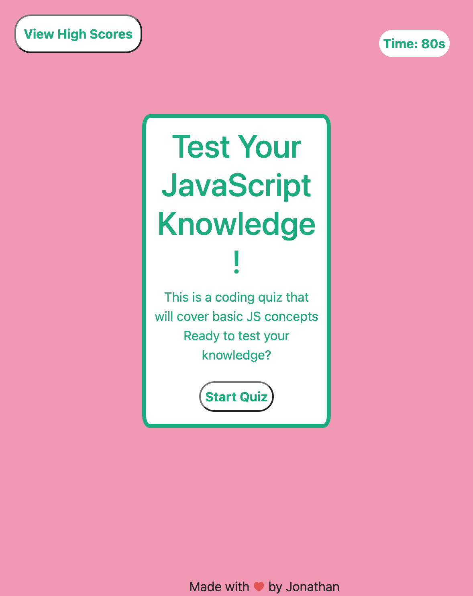

--------------------------------------

# Quiz-Time

This weeks task was to continue working and improving on a website that will display a quiz for the user. At the end of the quiz they will have the option to save their high score. 

--------------------------------------

## The Process 

This homework was a bit challenging compared to the previous ones, but I was able to work out the code by trial and error. I started by working out what variables I would need to start the quiz, have the questions appear, and stop the quiz once all questions have been answered so that the user can get their score.

Understanding what to search for helped me figure out the steps to making the code work. I also had to spend some time going over each line of code a couple of times, because I was stuck on figuring out how to display the answer choices along with the questions. I realized I was not targetting the question choices correctly so they were not appearing how it was intended to. 

The next problem I ran into was my submit score button was not saving the scores and displaying it on the next page where scores are displayed. I went back to activity 21-26 to review an approach to saving the scores using local storage. 

I would often find small breaks in my code so I would trace back before moving on to figure out how to fix the code. 

### Navigate my page

Here is a link to my deployed page that will display a quiz you can take to test your programming knowledge.

[Quiz PageLink](https://jmonrom.github.io/Quiz-Time/)